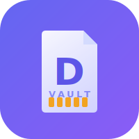
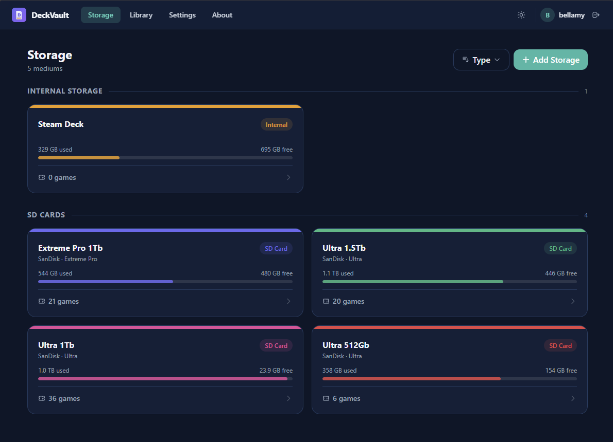
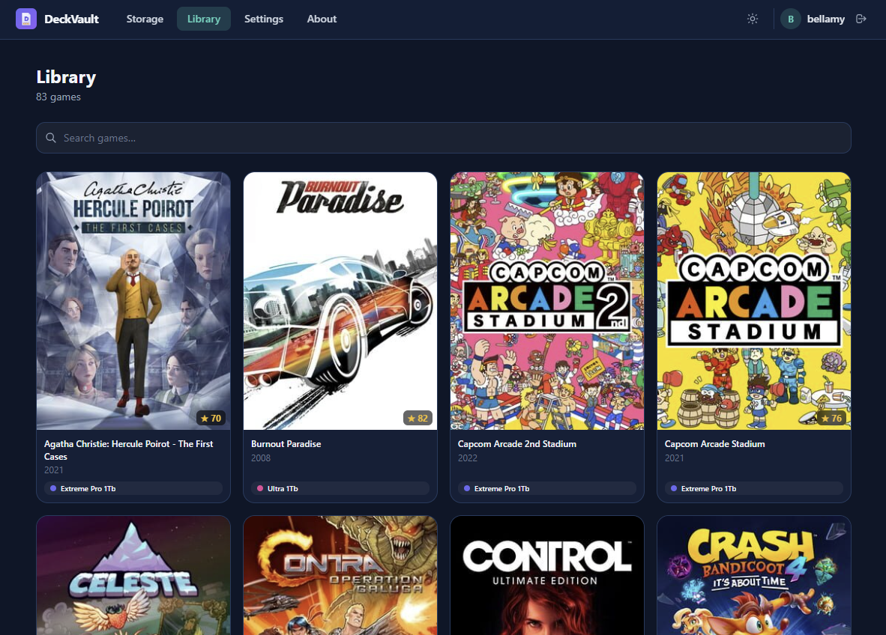
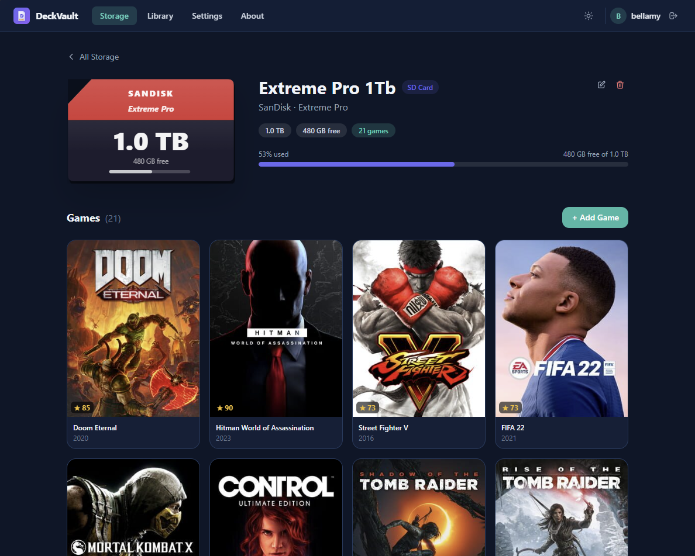

<div align="center">
  
  <h1>DeckVault</h1>
  <p>Open-source, self-hosted game library tracker for Steam Deck and other storage devices.</p>

  [](https://github.com/ellite/deckvault/stargazers)
  [](https://hub.docker.com/r/bellamy/deckvault)
  [](https://github.com/ellite/deckvault/graphs/contributors)
  [](https://github.com/sponsors/ellite)
  [](https://github.com/ellite/deckvault/releases/latest)
  [](https://github.com/ellite/deckvault/actions/workflows/release.yml)
</div>

---

DeckVault tracks which games are installed across your **internal storage, SD cards, HDDs, and SSDs** — all from a single dashboard. It integrates with IGDB for cover art and metadata, detects duplicates across devices, and ships as a single Docker container with no external dependencies.

## Table of Contents

- [Features](#features)
- [Screenshots](#screenshots)
- [Getting Started](#getting-started)
  - [Docker Compose](#docker-compose)
  - [Docker Run](#docker-run)
  - [First Setup](#first-setup)
  - [Updating](#updating)
- [Configuration](#configuration)
- [IGDB Setup](#igdb-setup)
- [Data](#data)
- [Development](#development)
- [Contributors](#contributors)
- [License](#license)

## Features

- **Storage dashboard**: Overview of all your storage devices with usage stats at a glance.
- **Per-device game lists**: See exactly which games are on each SD card, HDD, SSD, or internal drive.
- **IGDB integration**: Search IGDB to add games with cover art and metadata automatically.
- **Library view**: All games across all devices in one place, with duplicate detection highlighted.
- **Multiple device types**: Supports internal storage, SD cards, HDDs, and SSDs with color-coding.
- **Dark/light theme**: Follows your system preference with a manual override.
- **PWA-ready**: Install DeckVault on any device — desktop, Android, or iOS — for a native app feel.
- **JWT authentication**: Secure session cookies, no third-party auth required.
- **Single container**: Frontend and backend ship together — no separate services to manage.

## Screenshots



<details>
<summary>See more screenshots</summary>

**Library**


**Storage**


</details>

## Getting Started

### Prerequisites

- [Docker](https://docs.docker.com/get-docker/) and [Docker Compose](https://docs.docker.com/compose/install/)

> Images are hosted on **Docker Hub** (`bellamy/deckvault`). A mirror is also available on GHCR (`ghcr.io/ellite/deckvault`) if you prefer.

### Docker Compose

1. Download the compose file:

```bash
curl -o docker-compose.yml https://raw.githubusercontent.com/ellite/deckvault/main/docker-compose.yml
```

2. Generate a secret key and set it in `docker-compose.yml`:

```bash
# Python
python3 -c "import secrets; print(secrets.token_hex(32))"

# OpenSSL
openssl rand -hex 32
```

```yaml
services:
  deckvault:
    image: ghcr.io/ellite/deckvault:latest
    container_name: deckvault
    restart: unless-stopped
    ports:
      - "4367:4367"
    environment:
      - PUID=1000
      - PGID=1000
      - SECRET_KEY=changeme   # ← generate with: openssl rand -hex 32
    volumes:
      - ./data:/app/backend/data
```

3. Start:

```bash
docker compose up -d
```

### Docker Run

```bash
docker run -d \
  --name deckvault \
  --restart unless-stopped \
  -p 4367:4367 \
  -e PUID=1000 \
  -e PGID=1000 \
  -e SECRET_KEY="$(openssl rand -hex 32)" \
  -v ./data:/app/backend/data \
  ghcr.io/ellite/deckvault:latest
```

### First Setup

1. Open `http://localhost:4367` in your browser.
2. Register an account — all data is local to your instance.
3. Add your first storage device and start tracking games.

### Updating

```bash
docker compose pull && docker compose up -d
```

Database migrations run automatically on startup — no manual steps required.

## Configuration

| Variable | Default | Description |
|---|---|---|
| `SECRET_KEY` | - | **Required.** JWT signing key. Generate with `openssl rand -hex 32`. |
| `PUID` | `1000` | User ID to run the process as. |
| `PGID` | `1000` | Group ID to run the process as. |
| `BACKEND_PORT` | `8000` | Internal port the backend binds to. Override only if `8000` conflicts on bare metal. |

## IGDB Setup

IGDB provides cover art and game metadata. It's optional — you can add games manually without it.

1. Go to [dev.twitch.tv](https://dev.twitch.tv/console) and create an application.
2. Copy the **Client ID** and generate a **Client Secret**.
3. In DeckVault, go to **Settings** and enter your credentials.

## Data

All data is stored in `./data/deckVault.db`. Back this file up to preserve your library.

The `data/` directory is a bind mount, so it persists across container rebuilds and restarts.

| Port | Service |
|------|---------|
| 4367 | DeckVault web UI |

The backend API is internal-only and not exposed outside the container.

## Development

<details>
<summary>View instructions</summary>

### Requirements

- Python 3.12+
- Node.js 22+

### Backend

```bash
cd backend
pip install -r requirements.txt
alembic upgrade head
uvicorn app.main:app --reload --port 8000
```

### Frontend

```bash
cd frontend
npm install
API_URL=http://localhost:8000 npm run dev
```

The frontend dev server starts on `http://localhost:4367` and proxies API calls to the backend on port `8000`.

</details>

## Contributors

<a href="https://github.com/ellite/deckvault/graphs/contributors">
  
</a>

## License

This project is licensed under the GNU General Public License, Version 3 - see the [LICENSE.md](LICENSE.md) file for details.
